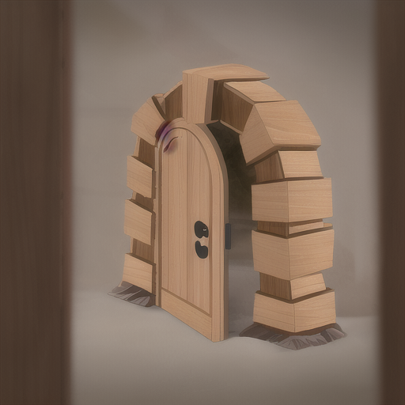
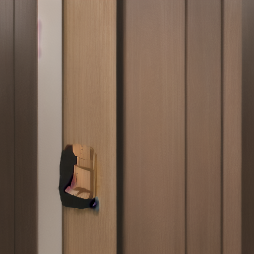

# Install
The best easiest way is to use ComfyUI Manager to install.

# Use
1. Create a workflow with Projector Controlnet Input as input, and Projectorz Output as output
2. Click Gen Art in Stable Projectorz
3. Done

# Info
This custom nodes enables Stable Projectorz to work with ComfyUI Directly.

StableProjectorz sends only controlnet images/masks and inpaint images/masks to ComfyUI nodes, and then ComfyUI process them and sends them back to StableProjectorz.

All settings in Stable Projectorz are accessable through ProjectorzParameter node and ProjectorzControlnetParameter node.

Enjoy!

 
<a href="samples/ProjectorzGen_Sample.json">Sample workflow for Generating with Controlnet(the default way with Projectorz)</a>
 

 
<a href="samples/ProjectorzInpaint_Sample.json">Sample workflow for inpainting(Projectorz brush fill)</a>
 

 
Basic settings:
 

 

 

 

 

